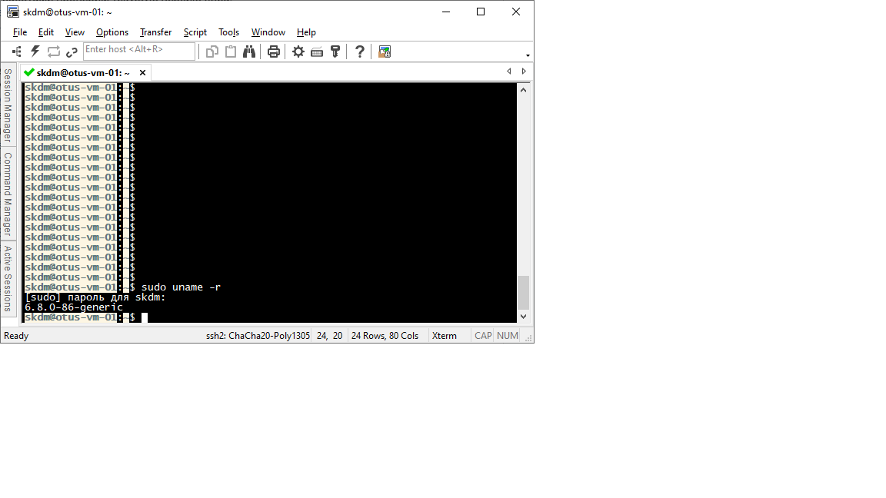
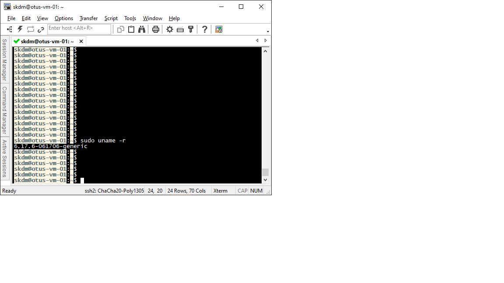

# Лабораторная работа "Обновление ядра в базовой системе".

В данной работе используется виртуальный хост под управлением ОС Ubuntu 22.04.5.
Перед началом работы проверим версию ядра:

  

Для обновления ядра необходимо скачать с сайта  http://kernel.ubuntu.com/~kernel-ppa/mainline/ четыре файла: два linux-headers, linux-image и linux-modules.

Затем установим ядро, и обновим загрузчик:

  

Ядро установлено, загрузчик обновлен. Перезагружаем хост.
После перезагрузки проверяем, что обновление ядра Linux выполнено:

  
