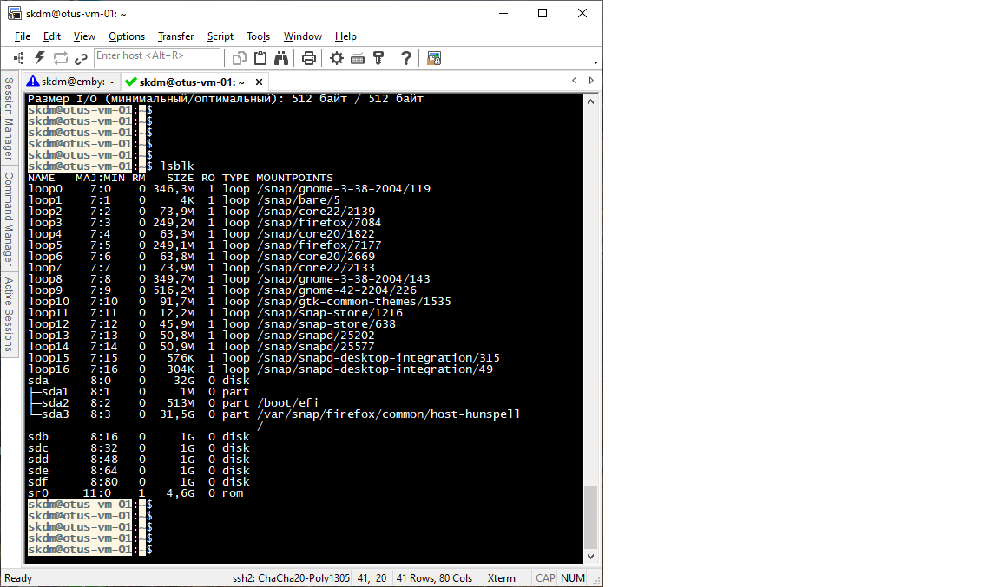
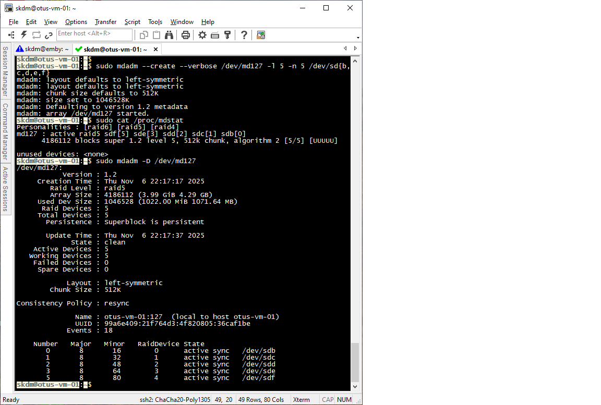
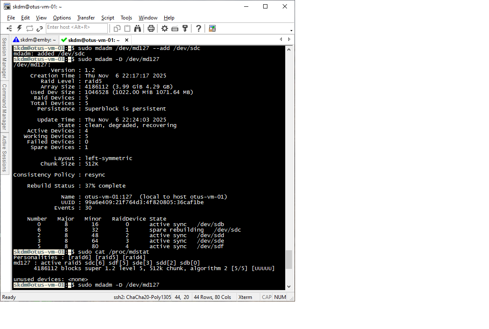
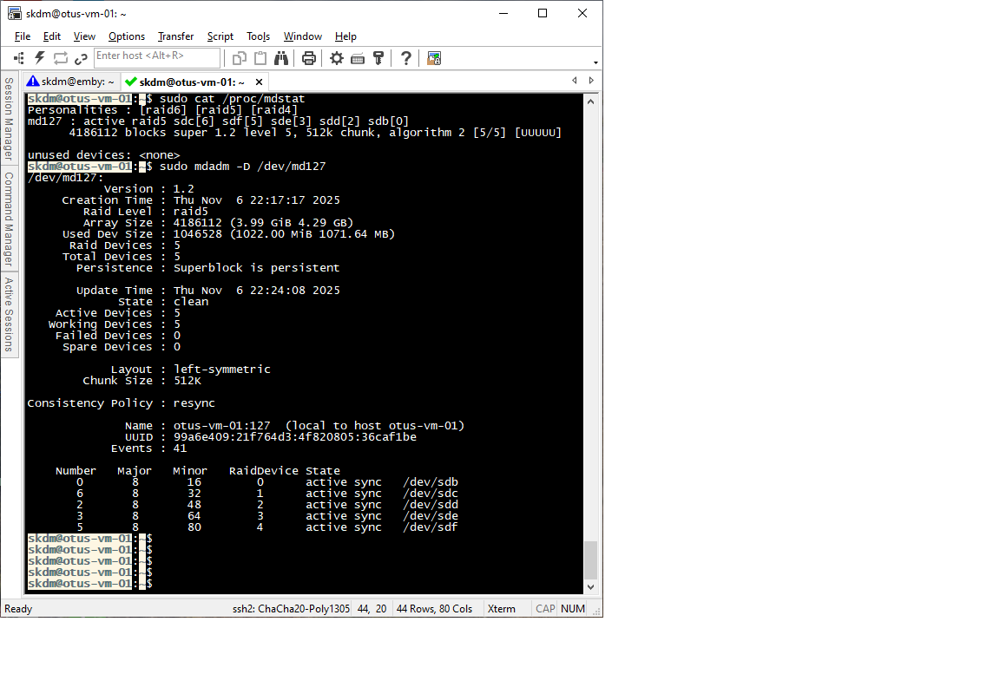
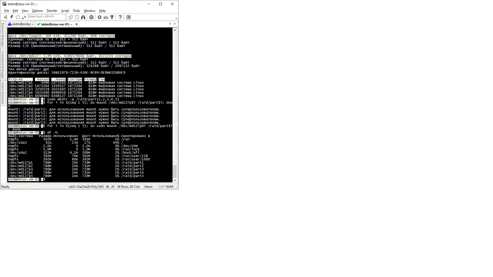

# Лабораторная работа "работа с mdadm".

В данной работе используется виртуальный хост под управлением ОС Ubuntu 22.04.5.
Предварительно к VM было добавлено дополнительно 5 дисков объемом 1Gb каждый:

  

Далее был собран RAID 5:

После того, как RAID был создан, выполним имитацию выхода из строя диска sdc: 

  

Добавим диск снова в RAID и проследим процесс rebuild-а 

  

Видим, что RAID восстановлен:

 

Далее создаем раздел GPT на RAID, создаем ФС и монтируем по каталогам

 

