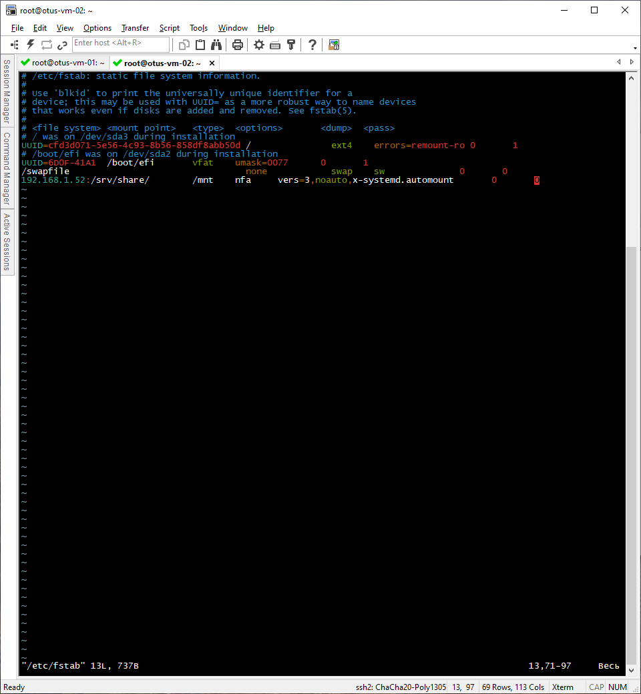
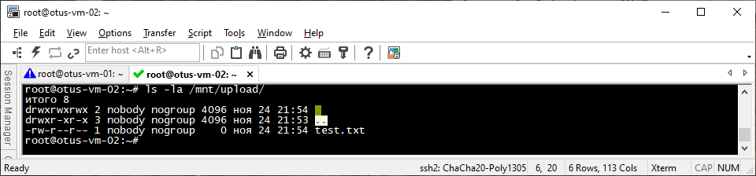
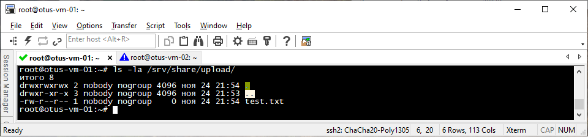

# Лабораторная работа "работа с zfs".
В данной работе используется два виртуальных хоста под управлением ОС Ubuntu 22.04.5:    
***otus-vm-01  -  сервер NFS  -  192.168.1.52/24***    
***otus-vm-02  -  клиент NFS  -  192.168.1.46/24***

## Настройка сервера NFS
На **otus-vm-01** производим установку NFS сервера:
```
root@otus-vm-01:~# apt install nfs-kernel-server
```
Создаём и настраиваем директорию, которая будет экспортирована в будущем:
```
root@otus-vm-01:~# mkdir -p /srv/share/upload
root@otus-vm-01:~# chown -R nobody:nogroup /srv/share/
root@otus-vm-01:~# chmod 0777 /srv/share/upload/
```
Cоздаём в файле /etc/exports структуру, которая позволит экспортировать ранее созданную директорию:
  
Экспортируем ранее созданную директорию:
```
root@otus-vm-01:~# exportfs -r
exportfs: /etc/exports [1]: Neither 'subtree_check' or 'no_subtree_check' specified for export "192.168.1.52/32:/srv/share".
  Assuming default behaviour ('no_subtree_check').
  NOTE: this default has changed since nfs-utils version 1.0.x
```
Проверяем экспортированную директорию следующей командой
```
root@otus-vm-01:~# exportfs -s
/srv/share  192.168.1.52/32(sync,wdelay,hide,no_subtree_check,sec=sys,rw,secure,root_squash,no_all_squash)
```
## Настройка клиента NFS  
Установим пакет с NFS-клиентом  
```
root@otus-vm-01:~# apt install nfs-common
```
Добавляем в /etc/fstab строку:
  
и выполняем команды:
```
root@otus-vm-01:~# systemctl daemon-reload 
root@otus-vm-01:~# systemctl restart remote-fs.target 
```
Проверим правильность монтирования
```
root@otus-vm-02:~# mount | grep mnt
nsfs on /run/snapd/ns/snapd-desktop-integration.mnt type nsfs (rw)
nsfs on /run/snapd/ns/firefox.mnt type nsfs (rw)
systemd-1 on /mnt type autofs (rw,relatime,fd=51,pgrp=1,timeout=0,minproto=5,maxproto=5,direct,pipe_ino=77321)
192.168.1.52:/srv/share/ on /mnt type nfs (rw,relatime,vers=3,rsize=524288,wsize=524288,namlen=255,hard,proto=tcp,timeo=600,retrans=2,sec=sys,mountaddr=192.168.1.52,mountvers=3,mountport=55625,mountproto=udp,local_lock=none,addr=192.168.1.52)
root@otus-vm-02:~#
```
Создадим файл **test.txt** на  *otus-vm-02* в директории */mnt/upload*:
```
root@otus-vm-02:~# touch /mnt/test.txt
```
Проверим его наличие:  
    

Далее проверим, появился ли этот файл на сервере *otus-vm-01*:  
     

Видим, что все корректно работает.


