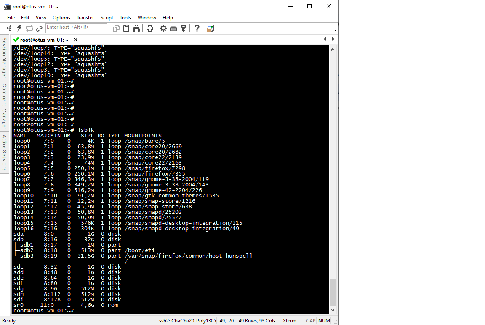
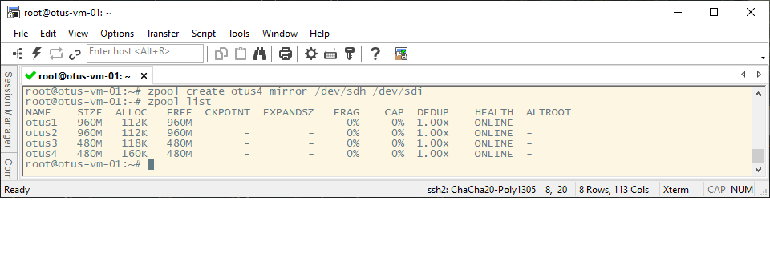
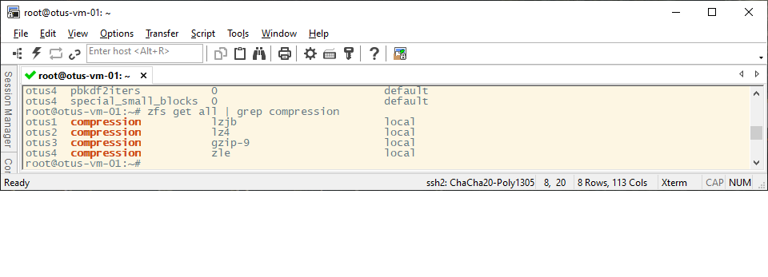
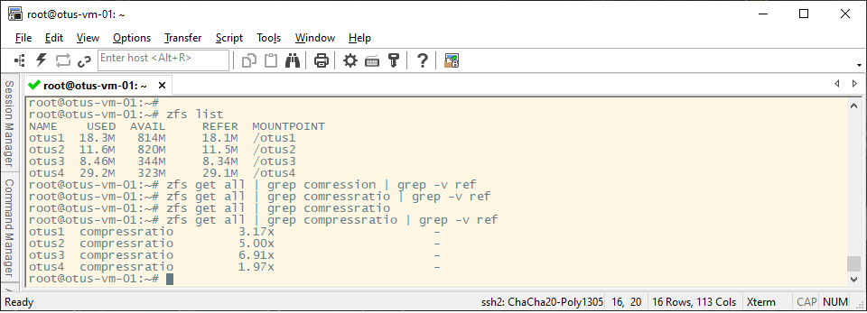
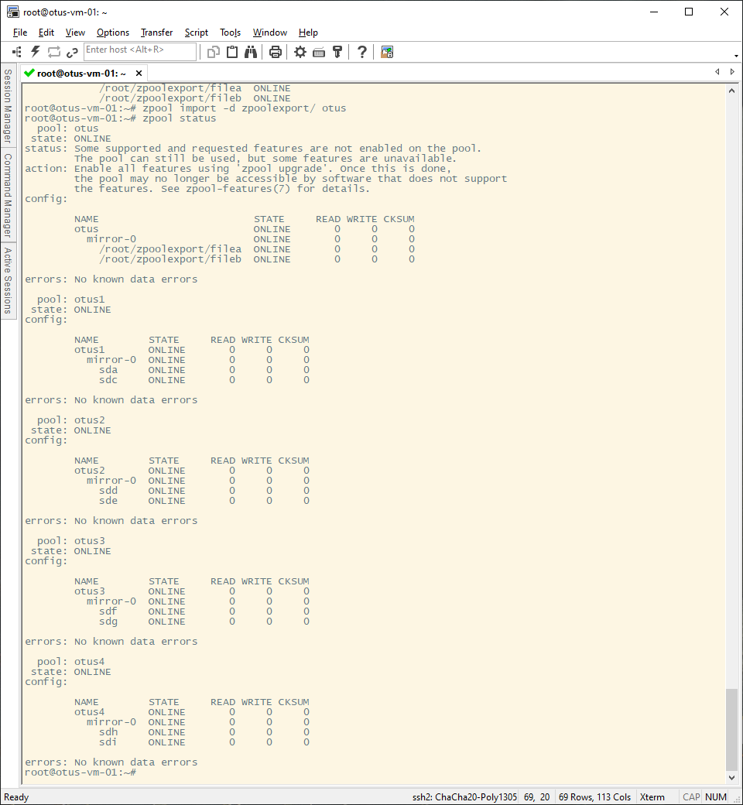
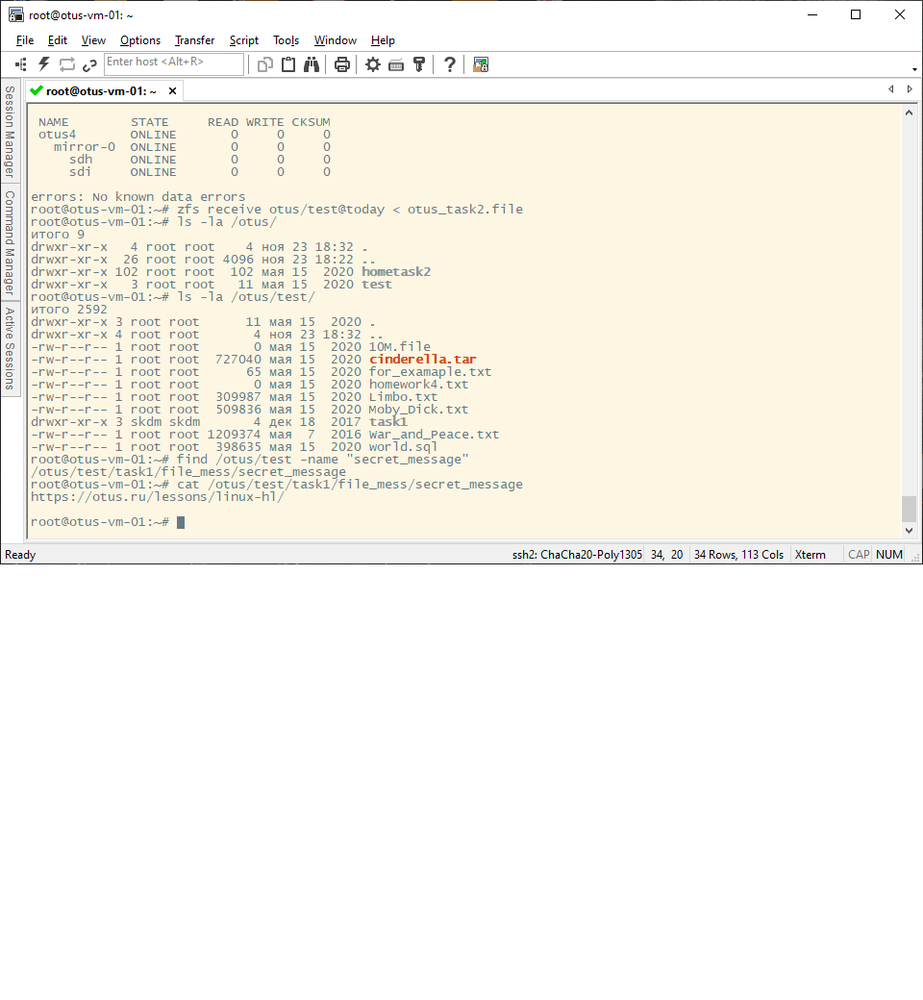

# Лабораторная работа "работа с zfs".
В данной работе используется виртуальный хост под управлением ОС Ubuntu 22.04.5.
Предварительно к VM было добавлено дополнительно 8 дисков:

  

## Определение алгоритма с наилучшим сжатием

Создаём 4 пула из двух дисков в режиме RAID 1:


Добавим разные алгоритмы сжатия в каждую файловую систему:
```
Алгоритм lzjb: zfs set compression=lzjb otus1
Алгоритм lz4:  zfs set compression=lz4 otus2
Алгоритм gzip: zfs set compression=gzip-9 otus3
Алгоритм zle:  zfs set compression=zle otus4
```
Проверим, что все файловые системы имеют разные методы сжатия:


Скачаем один и тот же текстовый файл во все пулы и после проверим, сколько места занимает один и тот же файл в разных пулах и проверим степень сжатия файлов:


Таким образом, у нас получается, что алгоритм gzip-9 самый эффективный по сжатию. 

## Определение настроек пула
Скачиваем архив в домашний каталог: 
```
[root@ ~]# wget -O archive.tar.gz --no-check-certificate 'https://drive.usercontent.google.com/download?id=1MvrcEp-WgAQe57aDEzxSRalPAwbNN1Bb&export=download'
```
Разархивируем его:
```
[root@otus-vm-01 ~]# tar -xzvf archive.tar.gz
zpoolexport/
zpoolexport/filea
zpoolexport/fileb
[root@otus-vm-01 ~]#
```
Проверим, возможно ли импортировать данный каталог в пул:
```
[root@otus-vm-01 ~]# zpool import -d zpoolexport/
   pool: otus
     id: 6554193320433390805
  state: ONLINE
status: Some supported features are not enabled on the pool.
	(Note that they may be intentionally disabled if the
	'compatibility' property is set.)
 action: The pool can be imported using its name or numeric identifier, though
	some features will not be available without an explicit 'zpool upgrade'.
 config:


	otus                         ONLINE
	  mirror-0                   ONLINE
	    /root/zpoolexport/filea  ONLINE
	    /root/zpoolexport/fileb  ONLINE
```
Данный вывод показывает нам имя пула, тип raid и его состав. 

Сделаем импорт данного пула к нам в ОС:


## Работа со снапшотом, поиск сообщения от преподавателя
Скачаем файл, указанный в задании:
```
[root@otus-vm-01 ~]# wget -O otus_task2.file --no-check-certificate https://drive.usercontent.google.com/download?id=1wgxjih8YZ-cqLqaZVa0lA3h3Y029c3oI&export=download
```
Восстановим файловую систему из снапшота:
```
zfs receive otus/test@today < otus_task2.file
```
Далее, ищем в каталоге /otus/test файл с именем “secret_message” и Смотрим содержимое найденного файла:




